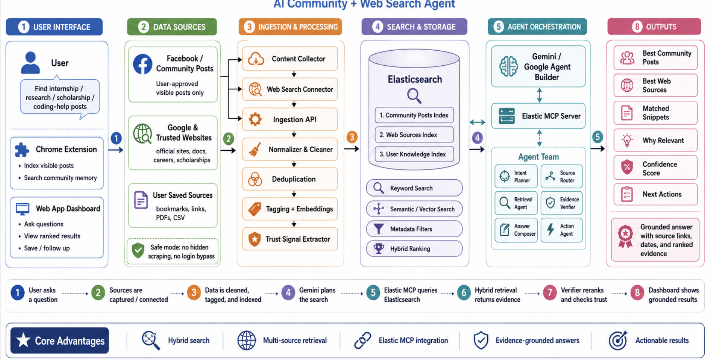
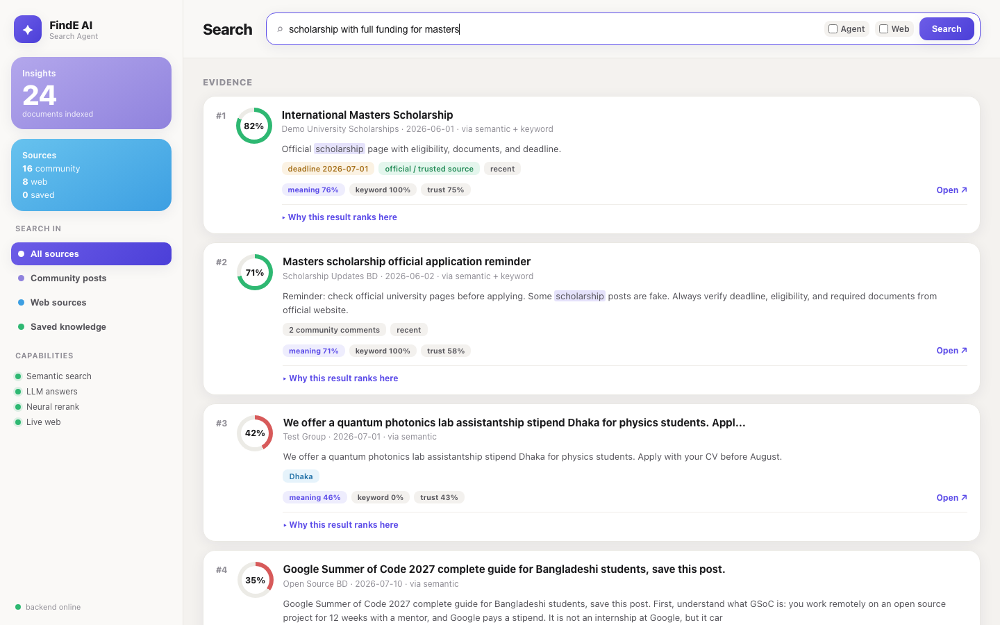
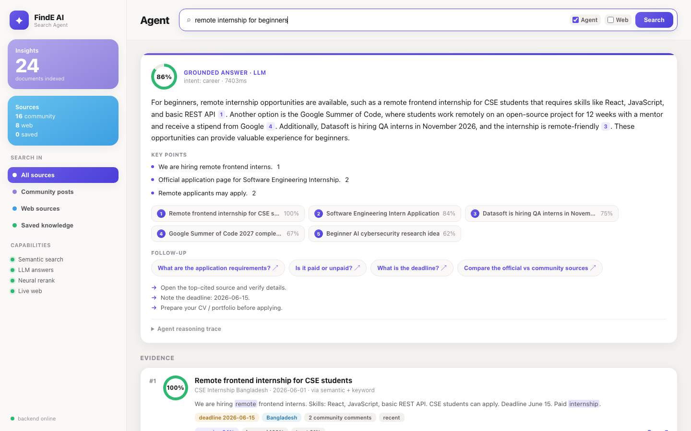

# FindE AI — Personal Opportunity Radar for Community Posts

**Semantic search agent over Facebook group posts + the web, in English and Bengali.**
Capture the posts you can see, then search them by *meaning* — and get grounded,
cited answers with fit scores, deadlines, and trust signals.



## Why this exists

Facebook's group search is per-group, English-first, and ranked by engagement.
FindE is the opposite: **your own cross-group corpus**, bilingual **bn+en** hybrid
retrieval, answer-my-question ranking, and deadline awareness — a personal
opportunity radar for internships, scholarships, research openings, and events.
No shipped product occupies this niche (2026 survey in the project README).

## Measured results

Golden eval set (bilingual EN/BN queries: cross-language, paraphrase, buried-detail):

| Pipeline | hit@1 | hit@5 | MRR | nDCG@10 | avg latency |
|---|---|---|---|---|---|
| Pure local — zero API keys | 93% | **100%** | 0.964 | 0.978 | **~90ms** |
| Full — LLM understanding + rerank | **100%** | 100% | 1.000 | 1.000 | ~1–2s |

Reproduce: `cd finde-ai/server && node eval/eval.js` (regression gate included).

## Screenshots

**Hybrid search** — fit ring, meaning/keyword/trust breakdown, "why this ranks here":



**Agent mode** — grounded answer with inline citations, key points, follow-ups, reasoning trace:



## What's inside

- **Chrome extension (MV3)** — captures only posts *visible on screen* when you
  click; LLM-judge matching of live-captured posts.
- **Hybrid retrieval** — multi-variant BM25 + kNN (local `multilingual-e5-small`
  embeddings, on-device ONNX) → weighted RRF fusion → MMR diversification →
  cross-encoder rerank. Bengali + English analyzers on every text field.
- **Dynamic agent** — LLM query understanding (translation both ways, intent,
  sub-query decomposition), reflect-and-retry on weak evidence, grounded cited
  answers with a full reasoning trace.
- **Data flywheel** — click/save logging → personal profile vector →
  personalized ranking; deadline extraction → `GET /api/digest` closing-soon radar.
- **Eval harness** — hit@k, MRR, recall@k, nDCG@10, latency p95, saved-baseline
  regression gate.

## Safety doctrine (by design, enforced server-side)

Visible-only capture. **No** auto-scroll, no hidden/private content, no login
bypass, no background crawling, no pooling or resale of captured content —
everything stays in *your* local Elasticsearch. This is a user agent for your
own screen, not a scraper.

## Get started

Full setup, API reference, and roadmap: **[finde-ai/README.md](finde-ai/README.md)**

```bash
cd finde-ai
npm run install:all && npm run elastic:up
npm run create-indices && npm run seed
npm --prefix server start        # dashboard at http://localhost:8080/app
```
